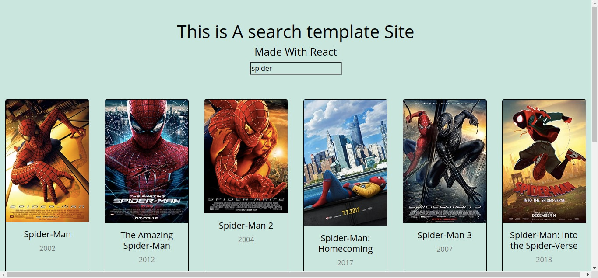

# movie-search Website
this is a  Webpage For Searching Films and Shows 



## Live Link

- Live: [DEMO](https://react-movie-search1.netlify.app)

## Built with

- React
- Async JavaScript (With Axios)
- DOM properties and attributes
- Pure JavaScript
- HTML & Css

## Getting Started
To get a local copy of the repository please run the following commands on your terminal:
- ```$ cd <folder>```
- ```$ git clone https://github.com/medobarakat/movie-search.git ```
- ```$ cd movie-search ```
- ```npm install```
- ```npm start```


## Authors

👤 **Ahmed Barakat**
- Github: [@medobarakat](https://github.com/medobarakat)

- Linkedin: [Ahmed Barakat](https://www.linkedin.com/in/ahmed-barakat-dev/)

- Email: [My Gmail](ahmedbarakat2401@gmail.com)

##    Contributing

Contributions, issues and feature requests are welcome!

## Show your support

Give a ⭐️ if you like this project!
